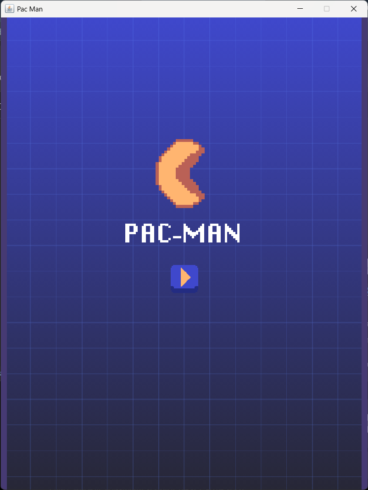
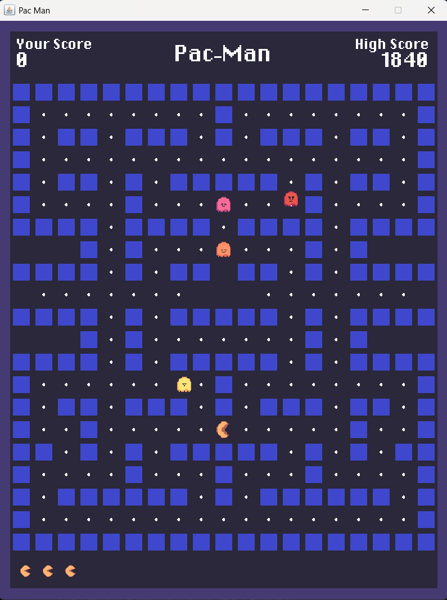
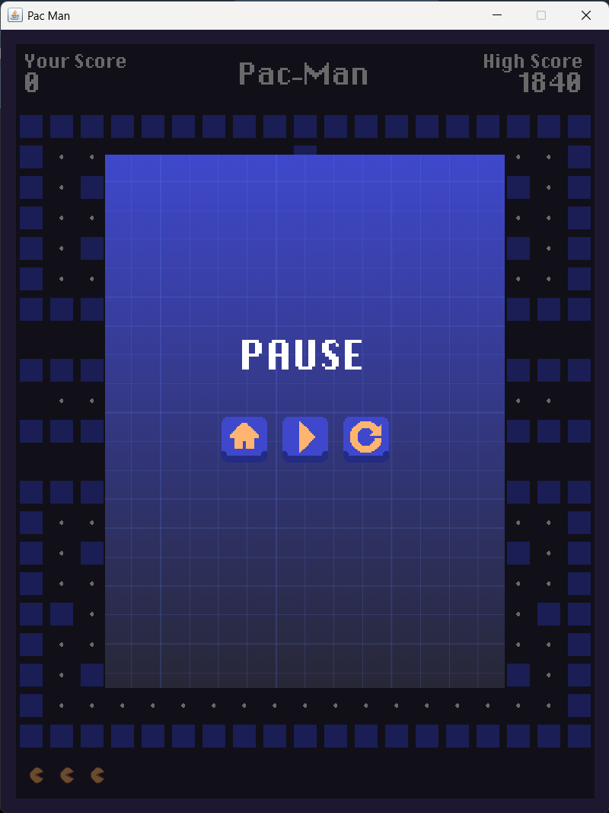
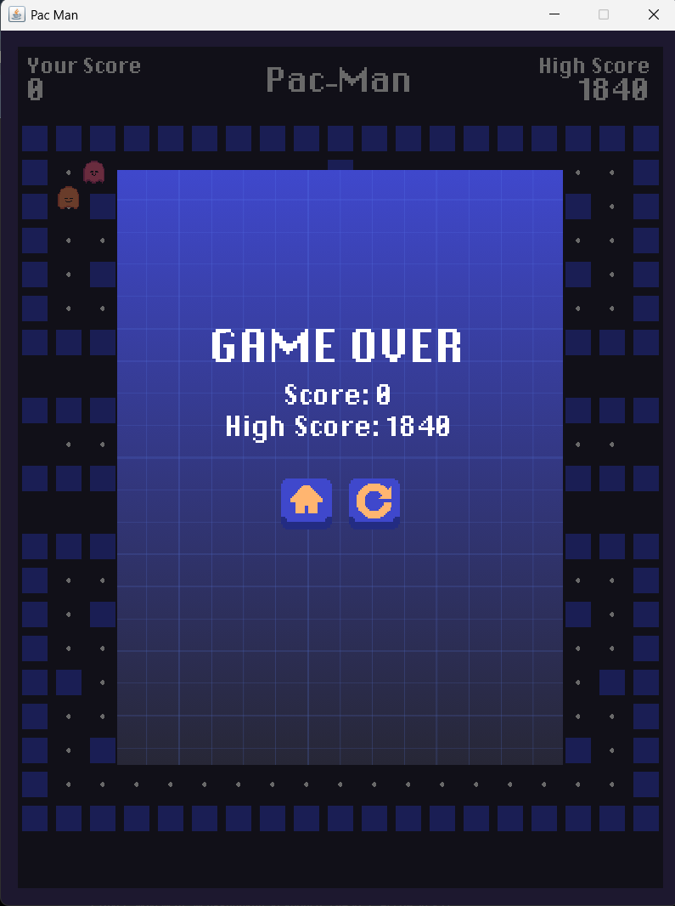
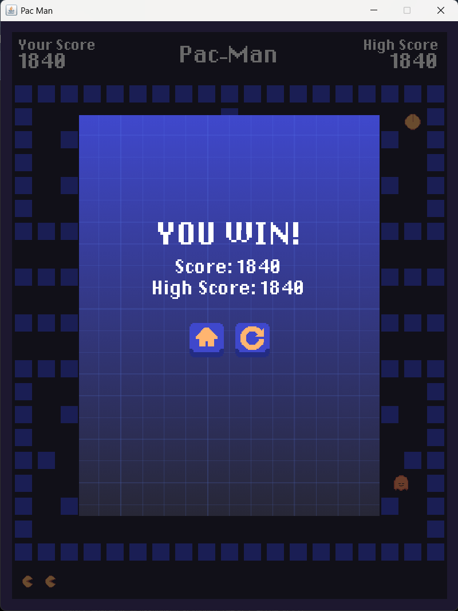

# Pac-Man 
Tugas mata kuliah Pemrograman Berorientasi Objek (OOP)

Pac-Man adalah game 2D yang terinspirasi dari game klasik Pac-Man. Game ini dikembangkan dengan mengimplementasikkan konsep Object-Oriented Programming (OOP). Dalam game ini, pemain harus mengumpulkan seluruh makanan di dalam labirin sambil menghindari hantu dengan jumlah nyawa yang terbatas.

## Preview






## Fitur
- Gerak pacman & hantu berbasis tile map
- Animasi sprite (pacman & hantu, multi-frame dari sprite sheet)
- Player movement menggunakan keyboard (WASD / Arrow Keys)
- Collectible food
- Lives system
- Enemy (Ghost)
- Score system + high score yang tersimpan permanen (`highscore.txt`)
- Tunnel wrap-around (tembus kiri-kanan lewat celah `O`)
- Collision detection antara Pac-Man, Ghost, dan Food
- Game Over dan  Win condition
- Game Over dan Win screen
- Main menu dan Pause men

## Struktur Project
```
Pac-Man
│
├── assets/  Game assets (sprites, map, UI, font)
│
├── src/
│   ├── Main.java               | Entry point aplikasi yang menjalankan game dan membuka window utama game.                     
│   ├── GameBoard.java          | Game loop, gambar layar, cek tabrakan, baca keyboard.                                         
│   ├── GameState.java          | Mengatur perpindahan antar state permainan seperti Menu, Playing, Pause, Win, dan Game Over. 
│   ├── GameMap.java            | Layout tile map & pembuatan objek dari map.                                                  
│   ├── GameImages.java         | Load semua asset gambar (sprite sheet & tile).                                                
│   ├── Player.java             | Mengatur karakter Pacman, termasuk pergerakan, animasi, dan interaksi dengan objek lain.      
│   ├── Ghost.java              | Mengatur perilaku musuh, termasuk pergerakan dan animasi.                             
│   ├── Food.java               | Makanan atau poin yang dapat dikumpulkan pemain untuk memperoleh skor.                      
│   ├── Wall.java               | Tembok atau dinding sebagai rintangan pada labirin.                                   
│   ├── SpriteAnimation.java    | Mengatur pergantian frame animasi pada karakter dan objek permainan.                      
│   ├── SpriteSheet.java        | Memproses sprite sheet menjadi kumpulan frame yang digunakan untuk animasi.                
│   ├── UiButton.java           | Mengatur komponen tombol pada antarmuka pengguna.                                            
│   ├── HighScoreStorage.java   | Menyimpan dan memuat data skor tertinggi ke dalam file.                                      
│   └── Block.java              | Main Class yang menyimpan atribut umum objek permainan, seperti posisi dan ukuran.           
│
└── README.md
```

## Cara Menjalankan

### Opsi 1 — Run File Executable (.jar)
1. Download atau clone repository ini.
2. Buka folder project.
3. Jalankan file **`Pac-Man.jar`** dengan melakukan double-click.
4. Game akan terbuka secara otomatis.

### Opsi 2 — Run dari Source Code
1. Clone repository
```bash
git clone https://github.com/ithaapy/Pac-Man.git
```
2. Buka project menggunakan IDE seperti VS Code, IntelliJ IDEA, atau NetBeans.
3. Compile project.
4. Jalankan `Main.java`.

## Kontrol
- Gerak: `↑ ↓ ← →` atau `W A S D`

## Asset
- Pac-Man Practice Assets by CheckpointCafé.Dev  
  https://checkpointcafe.itch.io/pacman-practice-assets  
  *Sprites: Pac-Man, Ghosts, Maze Tiles*
- Pixel UI Button Icon Platformer by BDragon1727  
  https://bdragon1727.itch.io/pixel-ui-button-icon-platformer  
  *UI Button Assets*
- GUI Buttons by Nam Dinh  
  https://namdinh.itch.io/gui-buttons  
  *Additional GUI Button Assets*
- Pac-Man Java by ImKennyYip  
  https://github.com/ImKennyYip/pacman-java  
  *Wall sprite (PNG), Power Food (PNG), and programming reference*
- DePixel Halbfett by Ingo Zimmermann (ingoFonts)  
  https://www.ingofonts.com/  
  *Font: DePixelHalbfett.ttf


## Lisensi
Proyek ini dibuat hanya untuk tujuan edukasi.
This project was developed for educational purposes only.


